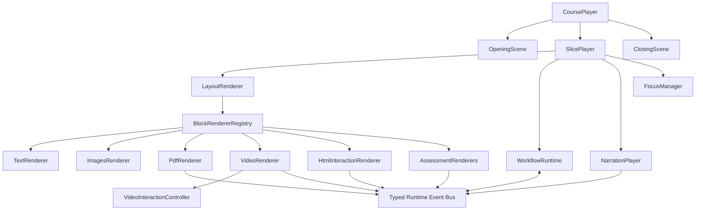

# Student Course Runtime: Interaction Model, Data Contract, and Renderer Architecture

Date: 2026-08-15

Status: **Implemented and shipped** (updated 2026-08-17). This was the original conceptual design; it has since been built and is live in production. The **as-built source of truth** is the TypeScript packages `packages/course-contract`, `packages/course-runtime`, and `packages/course-renderer`, pinned at git tag **`course-authoring-v1.0.0`** — if any detail here and the code disagree, the code (Zod contract) wins. For how the teacher-side generator builds against these packages, plus the authoring/publish API, see **`docs/2026-08-17-course-authoring-api-handover.md`**. The data-model sections below remain an accurate description of the shipped contract; the only as-built delta is the host/app layout noted in §17.1.

## 1. Purpose

This document defines the student-facing course runtime model for an AI-guided learning experience.

The course experience has four defining characteristics:

1. A live AI opening greets the learner, introduces the course, estimates the time required, and connects the course to permitted learning-history signals.
2. The main course is fully pre-generated. Each screen combines prepared learning materials, a prepared layout, prepared narration audio, and a deterministic teaching workflow.
3. One Slice occupies one desktop screen. A Slice can contain text, images, PDFs, videos, interactive HTML, and assessment Blocks.
4. A live AI closing combines a teacher-approved course summary with evidence from the learner's current CourseSession.

The design targets desktop browsers. Mobile presentation is outside the first release.

## 2. Confirmed Product Decisions

- `Part` is a learning stage and can contain multiple Slices.
- `Slice` is the atomic full-screen learning step.
- `Block` is a material or interaction placed inside a Slice.
- A Slice contains `blocks`, `layout`, `narrations`, `workflow`, and `navigation`.
- Normal Slice narration is pre-generated as text and audio.
- A Slice Workflow can show, hide, focus, enable, disable, play, wait, branch, and navigate.
- Correct and incorrect answers may enter different Workflow Steps.
- The course path is linear. Conditional branching stays inside the current Slice.
- Video-timeline interactions stay inside the Video Block and Video Player.
- Slice Workflow coordinates narration and behavior across Blocks.
- Opening and Closing are special course-level Runtime Scenes, not ordinary Slices.
- Opening and Closing are generated at runtime and stored in CourseSession.
- On-demand live AI tutoring inside normal Slices is outside the first release.
- The first Layout library contains `full`, `split-horizontal`, `split-vertical`, and `grid`.
- Arbitrary nested Layouts are not supported.
- CourseDefinition never contains student-specific data.
- CourseBlueprint, CourseDefinition, and CourseSession are separate data layers.

## 3. Three Data Layers

### 3.1 CourseBlueprint

CourseBlueprint is the semantic authoring result produced by the existing course-building Skills.

It describes:

- what the course teaches;
- its Parts, Pieces, materials, and assessments;
- teacher-approved answers, rubrics, and feedback;
- source coverage and pedagogical intent.

CourseBlueprint is input to a later course-experience design Skill. It is not consumed directly by the student Renderer.

### 3.2 CourseDefinition

CourseDefinition is the complete, platform-executable course package.

It describes:

- ordered Parts and Slices;
- every student-facing Block;
- full-screen Layout selection;
- pre-generated narration text and audio;
- deterministic Slice Workflows;
- Opening and Closing generation inputs;
- objective alignment and estimated duration.

CourseDefinition is shared by every learner assigned the course.

### 3.3 CourseSession

CourseSession is one learner's runtime state for one course attempt.

It contains:

- generated Opening and Closing results;
- current Part, Slice, and Workflow Step;
- Slice completion states;
- answers, attempts, interaction results, and timing;
- navigation and media events;
- the evidence used to generate the Closing.

CourseSession is stored by the platform. It never becomes part of the course package.

```text
CourseBlueprint
      |
      | course-experience design Skill
      v
CourseDefinition
      |
      | CourseRenderer + CourseRuntime
      v
CourseSession
```

## 4. Course Package

The runtime package uses relative asset paths.

```text
course/
├── course.json
├── assets/
│   ├── audio/
│   ├── captions/
│   ├── images/
│   ├── pdfs/
│   └── videos/
└── interactions/
    ├── html/
    └── video/
```

`course.json` is the canonical CourseDefinition. It does not contain object-storage domains or local absolute paths.

Authoring provenance stays outside the runtime package:

```text
.course-work/
├── course-blueprint.json
└── course-runtime-source-map.json
```

`course-runtime-source-map.json` links generated Part, Slice, Block, Narration, and Workflow IDs back to CourseBlueprint IDs. Local preview annotations use this map when a Skill revises and regenerates the course. The student application does not need this authoring record.

An AssetResolver converts each relative path into a local preview URL, draft URL, or production CDN URL.

```ts
interface AssetResolver {
  resolve(relativePath: RelativeAssetPath): string
}
```

## 5. CourseDefinition Top-Level Contract

```ts
interface CourseDefinitionDocument {
  schemaVersion: "2.0"
  course: CourseDefinition
}

interface CourseDefinition {
  id: CourseId
  title: string
  language: string
  estimatedMinutes: number
  objectives: CourseObjective[]
  opening: OpeningDefinition
  parts: PartDefinition[]
  closing: ClosingDefinition
}

interface CourseObjective {
  id: ObjectiveId
  text: string
  evidenceBlockIds: BlockId[]
}
```

Normative rules:

- IDs use stable lower-case hyphenated strings.
- IDs for Courses, Objectives, Parts, Slices, Blocks, Narrations, and Workflow Steps are unique in their relevant namespaces.
- `estimatedMinutes` is derived from Slice estimates and validated against their total.
- Every Objective references at least one real evidence-producing Block.
- `language` uses a valid BCP 47 tag, such as `zh-CN`.
- Unknown properties fail deterministic validation unless a future Schema version explicitly permits them.

## 6. Opening and Closing Runtime Scenes

### 6.1 OpeningDefinition

OpeningDefinition contains approved facts and personalization boundaries. It does not contain a raw model Prompt.

```ts
type OpeningSignal =
  | "recent-course-topics"
  | "prior-objective-performance"

interface OpeningDefinition {
  learningPreview: string[]
  personalization: {
    enabled: boolean
    allowedSignals: OpeningSignal[]
  }
  fallback: {
    text: string
    audio?: RelativeAssetPath
  }
}
```

The platform combines:

- `course.title`;
- `course.estimatedMinutes`;
- `course.objectives`;
- `opening.learningPreview`;
- the allowed student-history signals.

The generated Opening must include:

- a greeting;
- a concise description of what the learner will do;
- the estimated learning time;
- an optional evidence-supported connection to prior learning;
- a clear invitation to begin.

The Renderer supplies the fixed start action. The learner-facing label is `一起开始吧` in the initial Chinese experience.

### 6.2 ClosingDefinition

```ts
type ClosingSignal =
  | "answers"
  | "attempts"
  | "time-on-slice"
  | "interaction-results"

interface ClosingDefinition {
  preparedSummary: string
  takeaways: string[]
  transferApplications: string[]
  personalization: {
    enabled: boolean
    allowedSignals: ClosingSignal[]
  }
  fallback: {
    text: string
    audio?: RelativeAssetPath
  }
}
```

The generated Closing must:

- remain consistent with `preparedSummary`;
- mention only CourseSession evidence that actually exists;
- distinguish completion from mastery;
- avoid unsupported claims about improvement;
- identify useful takeaways and transfer opportunities;
- use the static fallback when generation or speech synthesis fails.

### 6.3 Runtime Scene Results

Generated results belong to CourseSession.

```ts
interface RuntimeSceneResult {
  text: string
  audioUrl?: string
  generatedAt: string
  usedSignalTypes: string[]
  fallbackUsed: boolean
}
```

Model identifiers, Prompt templates, and generation parameters are platform configuration. They are not authored per course.

## 7. Part and Slice Contracts

```ts
interface PartDefinition {
  id: PartId
  title: string
  objectiveIds: ObjectiveId[]
  slices: SliceDefinition[]
}

interface SliceDefinition {
  id: SliceId
  title: string
  objectiveIds: ObjectiveId[]
  estimatedSeconds: number
  blocks: BlockDefinition[]
  layout: LayoutDefinition
  narrations: NarrationDefinition[]
  workflow: SliceWorkflow
  navigation: NavigationDefinition
}
```

Part is an organizational and pedagogical stage. It does not render as an independent learning screen unless a future CourseDefinition explicitly contains a Slice serving that purpose.

Slice is the atomic unit for:

- full-screen rendering;
- Workflow execution;
- narration playback;
- completion;
- navigation;
- timing;
- objective and evidence alignment;
- local preview annotations.

The first release uses a linear array order:

```text
Part 1 / Slice 1
Part 1 / Slice 2
Part 2 / Slice 1
...
Closing
```

Slice Workflow cannot conditionally jump to a different Slice. Its final Step may navigate only to the next Slice.

## 8. Shared Block Rules

```ts
type BlockDefinition =
  | TextBlock
  | ImagesBlock
  | PdfBlock
  | VideoBlock
  | InteractiveHtmlBlock
  | FillBlankBlock
  | SingleChoiceBlock
```

Every Block has:

```ts
interface BlockBase {
  id: BlockId
  type: BlockType
}
```

Shared rules:

- Block IDs are unique across the CourseDefinition.
- A Block belongs to exactly one Slice.
- A Block is assigned to exactly one Layout Slot.
- Block content never contains screen coordinates.
- Block content never contains student-specific state.
- Initial visibility and interactivity belong to the Slice Workflow.
- The old authoring-stage `blocking` field is not part of CourseDefinition 2.0.
- Interactive Blocks define completion semantics and emit typed runtime Events.
- Static Blocks do not claim learner completion or understanding.

## 9. Block Data Formats

### 9.1 TextBlock

```ts
interface TextBlock extends BlockBase {
  type: "text"
  content: string
}
```

Example:

```json
{
  "id": "comparison-explanation",
  "type": "text",
  "content": "Two conclusions can point in opposite directions without answering the same question."
}
```

Rules:

- `content` uses the platform's restricted Markdown subset.
- The Renderer sanitizes all generated HTML.
- Raw scripts, iframes, styles, and event handlers are forbidden.
- Text density must fit the selected desktop Layout at the platform's minimum supported font size.

Runtime Events: none required.

### 9.2 ImagesBlock

```ts
type ImagesPresentation = "single" | "side-by-side" | "gallery"

interface ImageItem {
  id: string
  source: RelativeAssetPath
  alt: string
  caption?: string
}

interface ImagesBlock extends BlockBase {
  type: "images"
  presentation: ImagesPresentation
  items: ImageItem[]
}
```

Example:

```json
{
  "id": "evidence-images",
  "type": "images",
  "presentation": "side-by-side",
  "items": [
    {
      "id": "original-chart",
      "source": "assets/images/original-chart.png",
      "alt": "The complete chart from the original paper",
      "caption": "Original chart"
    },
    {
      "id": "cropped-chart",
      "source": "assets/images/cropped-chart.png",
      "alt": "A version of the chart with its later segment removed",
      "caption": "Cropped version"
    }
  ]
}
```

Rules:

- `items` contains at least one image.
- `single` requires exactly one item.
- `side-by-side` requires exactly two items.
- `gallery` supports multiple related images with Renderer-owned navigation.
- Every item requires non-empty alternative text.
- Workflow can focus an entire ImagesBlock or one item through a TargetRef.

Runtime Events:

- `image.selected`, when a learner changes the active gallery item;
- no completion Event by default.

### 9.3 PdfBlock

```ts
interface PdfBlock extends BlockBase {
  type: "pdf"
  title: string
  source: RelativeAssetPath
  initialPage?: number
}
```

Example:

```json
{
  "id": "source-paper",
  "type": "pdf",
  "title": "Original Research Paper",
  "source": "assets/pdfs/source-paper.pdf",
  "initialPage": 1
}
```

Rules:

- The source must be an intact, teacher-confirmed PDF.
- The platform embeds the PDF and exposes a download action.
- CourseDefinition does not claim that opening, paging through, or downloading a PDF proves reading or understanding.
- Learning evidence must come from another assessment or interaction.
- `initialPage`, when present, is a positive one-based page number within the document.

Runtime Events:

- `pdf.opened`;
- `pdf.pageChanged`;
- `pdf.downloaded`.

These Events may be recorded as behavior evidence but do not emit `block.completed` in the first release.

### 9.4 VideoBlock

```ts
interface VideoInteractionRef {
  source: RelativeAssetPath
}

type VideoCompletionRule =
  | { rule: "video-ended" }
  | { rule: "video-ended-and-interactions-completed" }

interface VideoBlock extends BlockBase {
  type: "video"
  source: RelativeAssetPath
  poster?: RelativeAssetPath
  captions?: RelativeAssetPath
  durationSeconds?: number
  interaction?: VideoInteractionRef
  completion?: VideoCompletionRule
}
```

Example:

```json
{
  "id": "case-video",
  "type": "video",
  "source": "assets/videos/case.mp4",
  "poster": "assets/images/case-poster.jpg",
  "captions": "assets/captions/case.zh-CN.vtt",
  "durationSeconds": 195,
  "interaction": {
    "source": "interactions/video/case-video.json"
  },
  "completion": {
    "rule": "video-ended-and-interactions-completed"
  }
}
```

Rules:

- The first release uses MP4, H.264 video, optional AAC audio, and faststart.
- Captions use WebVTT.
- `durationSeconds`, when present, must match validated media metadata within the platform tolerance.
- Video-timeline interactions belong to the VideoInteraction file.
- Slice Workflow controls behavior before and after the Video Block and may play or pause the Block.
- A Video Block with required timeline interactions must use `video-ended-and-interactions-completed` when the Workflow waits for `block.completed`.

Runtime Events:

- `video.started`;
- `video.paused`;
- `video.ended`;
- `video.interaction.shown`;
- `video.interaction.completed`;
- `block.completed` when the configured completion rule is satisfied.

### 9.5 InteractiveHtmlBlock

```ts
type HtmlAspectRatio = "1:1" | "4:3"

interface InteractiveHtmlBlock extends BlockBase {
  type: "interactiveHtml"
  source: RelativeAssetPath
  protocolVersion: "1.0"
  aspectRatio: HtmlAspectRatio
  completion?: {
    rule: "interaction-complete"
  }
}
```

Example:

```json
{
  "id": "comparison-simulation",
  "type": "interactiveHtml",
  "source": "interactions/html/comparison-simulation.html",
  "protocolVersion": "1.0",
  "aspectRatio": "4:3",
  "completion": {
    "rule": "interaction-complete"
  }
}
```

Rules:

- Delivery is one self-contained HTML5 file.
- External scripts, styles, fonts, iframes, media, and network dependencies are forbidden.
- The content runs inside a sandboxed iframe.
- The iframe uses the versioned platform message protocol.
- Completion is accepted only after validating message type, version, source Window, session binding, and payload shape.
- Static validation cannot prove real browser behavior; preview verification remains mandatory.

Runtime Events:

- `interaction.ready`;
- `interaction.progress`;
- `interaction.completed`;
- `interaction.error`;
- `block.completed` after valid completion.

### 9.6 FillBlankBlock

```ts
interface GradedFillAssessment {
  mode: "graded"
  acceptedAnswers: string[]
  caseSensitive?: boolean
  correctFeedback?: string
  incorrectFeedback?: string
}

interface ReflectionAssessment {
  mode: "reflection"
  rubric: string
}

type FillBlankAssessment = GradedFillAssessment | ReflectionAssessment

type FillBlankCompletionRule =
  | { rule: "submit-any" }
  | { rule: "submit-correct" }
  | { rule: "submit-correct-or-exhausted"; maxAttempts: number }

interface FillBlankBlock extends BlockBase {
  type: "fillBlank"
  prompt: string
  placeholder?: string
  assessment: FillBlankAssessment
  completion: FillBlankCompletionRule
}
```

Graded example:

```json
{
  "id": "source-heading-check",
  "type": "fillBlank",
  "prompt": "Enter the heading shown on page 2.",
  "placeholder": "Section heading",
  "assessment": {
    "mode": "graded",
    "acceptedAnswers": [
      "2. Evidence Check",
      "Evidence Check"
    ],
    "caseSensitive": false,
    "correctFeedback": "You located the requested section.",
    "incorrectFeedback": "Return to page 2 and check the heading at the top."
  },
  "completion": {
    "rule": "submit-correct-or-exhausted",
    "maxAttempts": 3
  }
}
```

Reflection example:

```json
{
  "id": "evidence-reflection",
  "type": "fillBlank",
  "prompt": "What would you verify before comparing the two claims?",
  "assessment": {
    "mode": "reflection",
    "rubric": "The response should name at least one concrete check involving source, population, scale, or measurement."
  },
  "completion": {
    "rule": "submit-any"
  }
}
```

Rules:

- `graded` requires `acceptedAnswers` and is compatible with `submit-correct` or `submit-correct-or-exhausted`.
- `reflection` requires a rubric and uses `submit-any` in the first release.
- `submit-correct` has no attempt ceiling and completes only after a correct answer.
- `submit-correct-or-exhausted` completes after a correct answer or after the declared attempt limit, allowing the Workflow to deliver a complete explanation before continuing.
- Rubrics support later review and AI-assisted evaluation but do not authorize unbounded runtime AI grading in the first release.

Runtime Events:

- `answer.submitted`;
- `answer.correct`;
- `answer.incorrect`;
- `answer.attemptsExhausted`;
- `block.completed`.

### 9.7 SingleChoiceBlock

```ts
interface ChoiceOption {
  id: string
  label: string
}

interface GradedChoiceAssessment {
  mode: "graded"
  correctOptionId: string
  correctFeedback?: string
  incorrectFeedback?: string
}

interface SurveyChoiceAssessment {
  mode: "survey"
}

type SingleChoiceAssessment =
  | GradedChoiceAssessment
  | SurveyChoiceAssessment

type SingleChoiceCompletionRule =
  | { rule: "submit-any" }
  | { rule: "submit-correct" }
  | { rule: "submit-correct-or-exhausted"; maxAttempts: number }

interface SingleChoiceBlock extends BlockBase {
  type: "singleChoice"
  prompt: string
  options: ChoiceOption[]
  assessment: SingleChoiceAssessment
  completion: SingleChoiceCompletionRule
}
```

Graded example:

```json
{
  "id": "comparison-question",
  "type": "singleChoice",
  "prompt": "Can these two conclusions be compared directly?",
  "options": [
    {
      "id": "yes",
      "label": "Yes"
    },
    {
      "id": "not-yet",
      "label": "Not yet"
    }
  ],
  "assessment": {
    "mode": "graded",
    "correctOptionId": "not-yet",
    "correctFeedback": "Correct. Their boundaries and methods must be checked first.",
    "incorrectFeedback": "Opposite directions alone do not prove direct comparability."
  },
  "completion": {
    "rule": "submit-correct-or-exhausted",
    "maxAttempts": 3
  }
}
```

Survey example:

```json
{
  "id": "initial-position",
  "type": "singleChoice",
  "prompt": "Which claim currently seems more convincing?",
  "options": [
    {
      "id": "claim-a",
      "label": "Claim A"
    },
    {
      "id": "claim-b",
      "label": "Claim B"
    },
    {
      "id": "uncertain",
      "label": "I need more evidence"
    }
  ],
  "assessment": {
    "mode": "survey"
  },
  "completion": {
    "rule": "submit-any"
  }
}
```

Rules:

- `options` contains at least two unique option IDs.
- `correctOptionId` must reference an existing option.
- `survey` has no correct answer and uses `submit-any`.
- Workflow may branch on correctness only for `graded` assessment.

Runtime Events are the same as FillBlankBlock.

## 10. LayoutDefinition

```ts
type LayoutPreset =
  | "full"
  | "split-horizontal"
  | "split-vertical"
  | "grid"

type SplitRatio = "1:1" | "2:1" | "1:2"

interface LayoutSlot {
  id: string
  blockIds: BlockId[]
}

interface LayoutDefinition {
  preset: LayoutPreset
  ratio?: SplitRatio
  slots: LayoutSlot[]
}
```

Canonical Slots:

| Preset | Required Slot IDs | Additional rule |
| --- | --- | --- |
| `full` | `main` | One full-screen region |
| `split-horizontal` | `left`, `right` | `ratio` is required |
| `split-vertical` | `top`, `bottom` | `ratio` is required |
| `grid` | `cell-1` through `cell-2`, `cell-3`, or `cell-4` | Two to four cells |

Example:

```json
{
  "preset": "split-horizontal",
  "ratio": "2:1",
  "slots": [
    {
      "id": "left",
      "blockIds": [
        "case-video"
      ]
    },
    {
      "id": "right",
      "blockIds": [
        "comparison-question"
      ]
    }
  ]
}
```

Normative rules:

- Every Slice Block appears in exactly one Slot.
- A Slot may contain multiple ordered Blocks.
- Hidden Blocks keep their assigned Slot so reveal actions do not cause global reflow.
- Layouts do not nest.
- Layout does not contain arbitrary CSS, dimensions, coordinates, or scripts.
- The Renderer owns typography, spacing, minimum dimensions, and overflow behavior.
- A CourseDefinition that cannot fit the supported desktop viewport fails visual review; the Renderer must not shrink content below accessibility limits to make it pass.
- Complex custom presentation remains an `interactiveHtml` Block.

## 11. NarrationDefinition

Normal Slice narration is prepared before publication.

```ts
interface NarrationDefinition {
  id: NarrationId
  text: string
  audio: RelativeAssetPath
  durationSeconds?: number
}
```

Example:

```json
{
  "id": "introduce-video",
  "text": "Watch the video on the left and notice where the speaker changes the basis of comparison.",
  "audio": "assets/audio/introduce-video.mp3",
  "durationSeconds": 8.4
}
```

Rules:

- `text` is the canonical accessible transcript.
- `audio` is the prepared narration asset.
- `durationSeconds`, when present, must match validated audio metadata within tolerance.
- Workflow references narration by ID.
- A narration asset is not embedded directly in a Workflow Step.
- Runtime-generated Opening and Closing speech belongs to CourseSession, not this list.

## 12. Slice Workflow Model

### 12.1 Purpose

Slice Workflow is a constrained, deterministic state machine. It coordinates prepared narration, Block visibility, interaction availability, media playback, branching, and navigation.

It is data, not executable course code.

```ts
interface SliceWorkflow {
  version: "1.0"
  initialStepId: WorkflowStepId
  initialState?: SliceInitialState
  steps: WorkflowStep[]
}

interface SliceInitialState {
  visibleBlockIds?: BlockId[]
  enabledBlockIds?: BlockId[]
  focusedTarget?: TargetRef
}

interface WorkflowStep {
  id: WorkflowStepId
  enterActions: WorkflowAction[]
  transitions: WorkflowTransition[]
}

interface WorkflowTransition {
  on: WorkflowEventMatcher
  to: WorkflowStepId
}
```

Defaults when `initialState` is omitted:

- all Slice Blocks are visible;
- all interactive Blocks are enabled;
- no target is focused.

When `visibleBlockIds` is present, listed Blocks start visible and unlisted Blocks start hidden. When `enabledBlockIds` is present, listed interactive Blocks start enabled and unlisted interactive Blocks start disabled. Omitting either individual list preserves that list's default behavior.

Progressive-reveal Slices must declare an explicit `initialState`.

### 12.2 TargetRef

```ts
type TargetRef =
  | { blockId: BlockId }
  | { blockId: BlockId; itemId: string }
```

The second form supports focusing a specific image inside an ImagesBlock. The first release does not permit Workflow targeting of answer options.

### 12.3 Workflow Actions

```ts
type WorkflowAction =
  | { type: "show"; targetId: BlockId }
  | { type: "hide"; targetId: BlockId }
  | { type: "focus"; target: TargetRef }
  | { type: "clearFocus" }
  | { type: "enable"; targetId: BlockId }
  | { type: "disable"; targetId: BlockId }
  | { type: "playNarration"; narrationId: NarrationId }
  | { type: "pauseNarration"; narrationId: NarrationId }
  | { type: "stopNarration"; narrationId: NarrationId }
  | { type: "playBlock"; targetId: BlockId }
  | { type: "pauseBlock"; targetId: BlockId }
  | { type: "resetBlock"; targetId: BlockId }
  | { type: "startTimer"; timerId: string; durationSeconds: number }
  | { type: "cancelTimer"; timerId: string }
  | { type: "completeSlice" }
  | { type: "navigate"; target: "nextSlice" }
```

Action rules:

- `show`, `hide`, `enable`, and `disable` target Blocks in the current Slice.
- `focus` may target the current Slice's Block or supported child item.
- `playNarration`, `pauseNarration`, and `stopNarration` reference a current Slice Narration.
- `playBlock`, `pauseBlock`, and `resetBlock` require a Block type that supports the command.
- `completeSlice` marks the current Slice complete only after the Runtime verifies that all completion conditions on the active Workflow path are satisfied.
- `navigate` can target only `nextSlice` in a published Workflow.
- Manual previous-page behavior belongs to NavigationDefinition, not Workflow.
- Actions cannot contain code, expressions, URLs, or arbitrary payloads.
- `enterActions` execute in array order.
- WorkflowRuntime activates a Step's transition matchers before executing `enterActions`, preventing an immediately emitted Event from being missed.
- An Action failure emits a typed runtime error and does not silently advance the Workflow.

### 12.4 Waiting and Events

Waiting is represented by a Step remaining active until one of its declared Event transitions matches.

```ts
interface WorkflowEventMatcher {
  type: WorkflowEventType
  sourceId?: string
  interactionId?: string
  timerId?: string
}
```

Initial Event vocabulary:

| Event | Typical source |
| --- | --- |
| `narration.ended` | NarrationPlayer |
| `video.started` | VideoPlayer |
| `video.paused` | VideoPlayer |
| `video.ended` | VideoPlayer |
| `video.interaction.shown` | VideoInteractionController |
| `video.interaction.completed` | VideoInteractionController |
| `pdf.opened` | PdfViewer |
| `pdf.pageChanged` | PdfViewer |
| `interaction.completed` | HtmlInteractionFrame |
| `answer.submitted` | AssessmentBlock |
| `answer.correct` | AssessmentBlock |
| `answer.incorrect` | AssessmentBlock |
| `answer.attemptsExhausted` | AssessmentBlock |
| `block.completed` | Any completing Block |
| `student.continue` | Course controls |
| `timer.elapsed` | WorkflowRuntime |

Event payloads are recorded by CourseSession, but transitions match only standardized fields. CourseDefinition does not contain arbitrary conditional expressions.

### 12.5 Branching

Branching is allowed inside the current Slice.

```json
{
  "id": "wait-for-answer",
  "enterActions": [],
  "transitions": [
    {
      "on": {
        "type": "answer.correct",
        "sourceId": "comparison-question"
      },
      "to": "correct-explanation"
    },
    {
      "on": {
        "type": "answer.incorrect",
        "sourceId": "comparison-question"
      },
      "to": "remediation"
    },
    {
      "on": {
        "type": "answer.attemptsExhausted",
        "sourceId": "comparison-question"
      },
      "to": "complete-explanation"
    }
  ]
}
```

The Event producer decides whether `answer.incorrect` or `answer.attemptsExhausted` is emitted for the final failed attempt. Validators reject ambiguous overlapping transitions.

### 12.6 Workflow Validation

A published Workflow must satisfy all of the following:

- `initialStepId` exists;
- Step IDs are unique;
- every transition target exists;
- every Block, Narration, Timer, and Interaction reference exists;
- every Step is reachable from the initial Step;
- every reachable branch can reach a completion or navigation Step;
- no branch can bypass a configured required completion condition;
- only terminal paths may use `completeSlice` and `navigate`;
- no transition crosses into another Slice;
- no unsupported Action/Event combination exists;
- simple cycles require a bounded assessment attempt or an explicit learner action;
- the Workflow can be replayed deterministically from CourseSession events.

## 13. NavigationDefinition

```ts
interface NavigationDefinition {
  previous: "allowed"
  manualNext: "after-completion" | "allowed"
  autoNext: boolean
  revisit: "restore-completed-state"
}
```

First-release defaults:

```json
{
  "previous": "allowed",
  "manualNext": "after-completion",
  "autoNext": true,
  "revisit": "restore-completed-state"
}
```

Runtime behavior:

- the learner can pause narration at any time;
- the learner can revisit an already reached Slice;
- a required incomplete Slice prevents manual forward navigation;
- a revisited completed Slice restores its completed state;
- the learner can explicitly replay the Slice narration and Workflow;
- automatic navigation occurs only after the Slice reaches its valid terminal path.

## 14. Video Interaction Contract

Video-timeline interactions form a declarative media timeline, not a second general Workflow engine.

```ts
interface VideoInteractionDocument {
  schemaVersion: "1.1"
  video: {
    blockId: BlockId
    source: RelativeAssetPath
    durationSeconds: number
    cues: VideoInteractionCue[]
  }
}

interface VideoInteractionCue {
  id: string
  atSeconds: number
  pauseVideo: boolean
  required: boolean
  prompt: string
  activity: VideoInteractionActivity
}

type VideoInteractionActivity =
  | {
      type: "singleChoice"
      options: ChoiceOption[]
      assessment: SingleChoiceAssessment
      completion: SingleChoiceCompletionRule
    }
  | {
      type: "fillBlank"
      assessment: FillBlankAssessment
      completion: FillBlankCompletionRule
    }
```

Example:

```json
{
  "schemaVersion": "1.1",
  "video": {
    "blockId": "case-video",
    "source": "assets/videos/case.mp4",
    "durationSeconds": 195,
    "cues": [
      {
        "id": "prediction-check",
        "atSeconds": 42,
        "pauseVideo": true,
        "required": true,
        "prompt": "What do you predict will happen next?",
        "activity": {
          "type": "singleChoice",
          "options": [
            {
              "id": "same-basis",
              "label": "The comparison basis will stay the same"
            },
            {
              "id": "new-basis",
              "label": "The comparison basis will change"
            }
          ],
          "assessment": {
            "mode": "survey"
          },
          "completion": {
            "rule": "submit-any"
          }
        }
      }
    ]
  }
}
```

Rules:

- `blockId` references the owning Video Block.
- `source` resolves to the exact same video file as the owning Video Block.
- cue IDs are unique within the video;
- cue times are strictly increasing and inside the validated duration;
- final CourseDefinition does not contain unresolved semantic anchors or null times;
- required cues must complete before the Video Block can emit `block.completed` under `video-ended-and-interactions-completed`;
- Video Player emits standardized Events that Slice Workflow may observe;
- Slice Workflow normally waits on the Video Block's final `block.completed` Event.

## 15. Complete CourseDefinition Example

The example below contains one Part and one Slice to demonstrate the complete relationship between content, Layout, narration, Workflow, navigation, Opening, and Closing.

```json
{
  "schemaVersion": "2.0",
  "course": {
    "id": "evidence-comparability",
    "title": "Can These Two Claims Be Compared?",
    "language": "en",
    "estimatedMinutes": 3,
    "objectives": [
      {
        "id": "check-comparability",
        "text": "Check whether two claims share comparable objects, boundaries, and methods before comparing their conclusions.",
        "evidenceBlockIds": [
          "comparison-question"
        ]
      }
    ],
    "opening": {
      "learningPreview": [
        "Observe how two claims define their evidence",
        "Decide whether the claims can be compared directly"
      ],
      "personalization": {
        "enabled": true,
        "allowedSignals": [
          "recent-course-topics",
          "prior-objective-performance"
        ]
      },
      "fallback": {
        "text": "Welcome. In about three minutes, you will learn a practical check to use before comparing two conclusions."
      }
    },
    "parts": [
      {
        "id": "part-check-comparability",
        "title": "Check the Basis of Comparison",
        "objectiveIds": [
          "check-comparability"
        ],
        "slices": [
          {
            "id": "slice-observe-and-answer",
            "title": "Observe and Decide",
            "objectiveIds": [
              "check-comparability"
            ],
            "estimatedSeconds": 180,
            "blocks": [
              {
                "id": "case-video",
                "type": "video",
                "source": "assets/videos/case.mp4",
                "poster": "assets/images/case-poster.jpg",
                "captions": "assets/captions/case.en.vtt",
                "durationSeconds": 90,
                "interaction": {
                  "source": "interactions/video/case-video.json"
                },
                "completion": {
                  "rule": "video-ended-and-interactions-completed"
                }
              },
              {
                "id": "comparison-question",
                "type": "singleChoice",
                "prompt": "Can the two conclusions be compared directly?",
                "options": [
                  {
                    "id": "yes",
                    "label": "Yes"
                  },
                  {
                    "id": "not-yet",
                    "label": "Not yet"
                  }
                ],
                "assessment": {
                  "mode": "graded",
                  "correctOptionId": "not-yet",
                  "correctFeedback": "Correct. Their boundaries and methods must be checked first.",
                  "incorrectFeedback": "Opposite conclusions do not establish comparability."
                },
                "completion": {
                  "rule": "submit-correct-or-exhausted",
                  "maxAttempts": 2
                }
              }
            ],
            "layout": {
              "preset": "split-horizontal",
              "ratio": "2:1",
              "slots": [
                {
                  "id": "left",
                  "blockIds": [
                    "case-video"
                  ]
                },
                {
                  "id": "right",
                  "blockIds": [
                    "comparison-question"
                  ]
                }
              ]
            },
            "narrations": [
              {
                "id": "introduce-video",
                "text": "Watch the video and notice whether the two speakers define the same object and time range.",
                "audio": "assets/audio/introduce-video.mp3",
                "durationSeconds": 7.2
              },
              {
                "id": "introduce-question",
                "text": "Now decide whether the two conclusions can be compared directly.",
                "audio": "assets/audio/introduce-question.mp3",
                "durationSeconds": 4.1
              },
              {
                "id": "remediation",
                "text": "Look again at the object, time range, and method. Opposite conclusions may still describe different questions.",
                "audio": "assets/audio/remediation.mp3",
                "durationSeconds": 6.5
              },
              {
                "id": "slice-summary",
                "text": "Before comparing conclusions, first verify that the evidence is actually comparable.",
                "audio": "assets/audio/slice-summary.mp3",
                "durationSeconds": 4.8
              }
            ],
            "workflow": {
              "version": "1.0",
              "initialStepId": "introduce",
              "initialState": {
                "visibleBlockIds": [
                  "case-video"
                ],
                "enabledBlockIds": []
              },
              "steps": [
                {
                  "id": "introduce",
                  "enterActions": [
                    {
                      "type": "focus",
                      "target": {
                        "blockId": "case-video"
                      }
                    },
                    {
                      "type": "playNarration",
                      "narrationId": "introduce-video"
                    }
                  ],
                  "transitions": [
                    {
                      "on": {
                        "type": "narration.ended",
                        "sourceId": "introduce-video"
                      },
                      "to": "watch-video"
                    }
                  ]
                },
                {
                  "id": "watch-video",
                  "enterActions": [
                    {
                      "type": "enable",
                      "targetId": "case-video"
                    },
                    {
                      "type": "playBlock",
                      "targetId": "case-video"
                    }
                  ],
                  "transitions": [
                    {
                      "on": {
                        "type": "block.completed",
                        "sourceId": "case-video"
                      },
                      "to": "introduce-question"
                    }
                  ]
                },
                {
                  "id": "introduce-question",
                  "enterActions": [
                    {
                      "type": "show",
                      "targetId": "comparison-question"
                    },
                    {
                      "type": "enable",
                      "targetId": "comparison-question"
                    },
                    {
                      "type": "focus",
                      "target": {
                        "blockId": "comparison-question"
                      }
                    },
                    {
                      "type": "playNarration",
                      "narrationId": "introduce-question"
                    }
                  ],
                  "transitions": [
                    {
                      "on": {
                        "type": "narration.ended",
                        "sourceId": "introduce-question"
                      },
                      "to": "wait-for-answer"
                    }
                  ]
                },
                {
                  "id": "wait-for-answer",
                  "enterActions": [
                    {
                      "type": "enable",
                      "targetId": "comparison-question"
                    }
                  ],
                  "transitions": [
                    {
                      "on": {
                        "type": "answer.correct",
                        "sourceId": "comparison-question"
                      },
                      "to": "summarize"
                    },
                    {
                      "on": {
                        "type": "answer.incorrect",
                        "sourceId": "comparison-question"
                      },
                      "to": "remediate"
                    },
                    {
                      "on": {
                        "type": "answer.attemptsExhausted",
                        "sourceId": "comparison-question"
                      },
                      "to": "summarize"
                    }
                  ]
                },
                {
                  "id": "remediate",
                  "enterActions": [
                    {
                      "type": "disable",
                      "targetId": "comparison-question"
                    },
                    {
                      "type": "focus",
                      "target": {
                        "blockId": "case-video"
                      }
                    },
                    {
                      "type": "playNarration",
                      "narrationId": "remediation"
                    }
                  ],
                  "transitions": [
                    {
                      "on": {
                        "type": "narration.ended",
                        "sourceId": "remediation"
                      },
                      "to": "wait-for-answer"
                    }
                  ]
                },
                {
                  "id": "summarize",
                  "enterActions": [
                    {
                      "type": "clearFocus"
                    },
                    {
                      "type": "playNarration",
                      "narrationId": "slice-summary"
                    }
                  ],
                  "transitions": [
                    {
                      "on": {
                        "type": "narration.ended",
                        "sourceId": "slice-summary"
                      },
                      "to": "next"
                    }
                  ]
                },
                {
                  "id": "next",
                  "enterActions": [
                    {
                      "type": "completeSlice"
                    },
                    {
                      "type": "navigate",
                      "target": "nextSlice"
                    }
                  ],
                  "transitions": []
                }
              ]
            },
            "navigation": {
              "previous": "allowed",
              "manualNext": "after-completion",
              "autoNext": true,
              "revisit": "restore-completed-state"
            }
          }
        ]
      }
    ],
    "closing": {
      "preparedSummary": "The course introduced a comparability check that separates conclusion direction from the boundaries and methods behind the evidence.",
      "takeaways": [
        "Opposite conclusions may answer different questions",
        "Comparison requires compatible objects, boundaries, and methods"
      ],
      "transferApplications": [
        "Comparing news reports",
        "Reviewing research claims",
        "Checking AI-generated answers"
      ],
      "personalization": {
        "enabled": true,
        "allowedSignals": [
          "answers",
          "attempts",
          "time-on-slice",
          "interaction-results"
        ]
      },
      "fallback": {
        "text": "You completed the course. Before comparing two conclusions, first check whether their evidence is genuinely comparable."
      }
    }
  }
}
```

## 16. CourseSession Contract

The exact persistence model may evolve, but the runtime boundary requires at least the following state.

```ts
interface CourseSession {
  id: string
  courseId: CourseId
  courseSchemaVersion: "2.0"
  studentId: string
  status: "created" | "opening" | "in-progress" | "closing" | "completed"
  startedAt?: string
  completedAt?: string
  current?: {
    partId: PartId
    sliceId: SliceId
    workflowStepId: WorkflowStepId
  }
  opening?: RuntimeSceneResult
  sliceStates: Record<SliceId, SliceSessionState>
  events: CourseRuntimeEvent[]
  closing?: RuntimeSceneResult
}

interface SliceSessionState {
  status: "not-started" | "in-progress" | "completed"
  currentWorkflowStepId?: WorkflowStepId
  startedAt?: string
  completedAt?: string
  elapsedSeconds: number
  blockStates: Record<BlockId, BlockSessionState>
}

interface BlockSessionState {
  visible: boolean
  enabled: boolean
  completed: boolean
  attempts?: number
  answer?: unknown
  mediaPositionSeconds?: number
  interactionResult?: unknown
}

interface CourseRuntimeEvent<TPayload = unknown> {
  id: string
  sessionId: string
  courseId: CourseId
  partId?: PartId
  sliceId?: SliceId
  sourceId: string
  type: WorkflowEventType | string
  occurredAt: string
  payload: TPayload
}
```

Each supported Event type has a versioned, typed payload in `course-runtime`; `unknown` above marks the generic envelope, not permission for unvalidated data. CourseSession records typed Events and derives current state. This supports replay, debugging, Closing generation, and future analytics without placing runtime state inside CourseDefinition.

## 17. Renderer Architecture

### 17.1 Architectural Principle

CourseRenderer is the only implementation of the student course presentation contract. The local review application and the student application consume the same package.

```text
packages/
├── course-contract/    # Zod schemas + validators (single source of truth)
├── course-runtime/     # headless session state machine + adapter contracts
└── course-renderer/    # the React student renderer (CoursePlayer)
```

**As-built note (2026-08-17):** the three packages exist as designed. The student host is `apps/web` (`src/shell/courses/RuntimeCoursePlayer.tsx`) — *not* the separate `apps/course-preview` / `apps/student-web` apps this draft envisioned. Because CourseRenderer is chrome-agnostic, the same `CoursePlayer` runs both in the production web host and in a local offline preview assembled from the same package (offline adapters: `InMemorySessionAdapter`, a local `AssetResolver`, and fallback-text Opening/Closing stubs). No dedicated preview app was needed — see the handover doc §6 for the local-preview host recipe.

### 17.2 Component Structure



### 17.3 CoursePlayer

CoursePlayer owns the course-level lifecycle:

```text
load and validate CourseDefinition
→ create or restore CourseSession
→ generate or restore Opening
→ start ordered Part/Slice path
→ complete final Slice
→ generate or restore Closing
→ complete CourseSession
```

CoursePlayer coordinates adapters but does not implement Block-specific rendering.

### 17.4 SlicePlayer

SlicePlayer owns one full-screen Slice:

- creates Layout slots;
- mounts Block renderers;
- applies initial visibility and interactivity;
- starts WorkflowRuntime;
- routes typed Events;
- controls narration and focus;
- persists SliceSession state;
- requests navigation after valid completion.

### 17.5 LayoutRenderer

LayoutRenderer maps the four Layout Presets to stable desktop CSS.

Responsibilities:

- enforce canonical Slot names;
- apply supported ratios;
- reserve hidden Block positions;
- maintain minimum font and control sizes;
- prevent uncontrolled page-level overflow;
- expose measurable Slot and Block bounds for visual validation;
- avoid course-provided CSS.

LayoutRenderer does not interpret learning content or Workflow.

### 17.6 BlockRendererRegistry

```ts
interface BlockRendererProps<TBlock extends BlockDefinition> {
  block: TBlock
  assetResolver: AssetResolver
  state: BlockSessionState
  visible: boolean
  enabled: boolean
  focusedItemId?: string
  emit: (event: CourseRuntimeEvent) => void
}
```

The registry selects a renderer by Block `type`.

```ts
const blockRenderers = {
  text: TextRenderer,
  images: ImagesRenderer,
  pdf: PdfRenderer,
  video: VideoRenderer,
  interactiveHtml: HtmlInteractionRenderer,
  fillBlank: FillBlankRenderer,
  singleChoice: SingleChoiceRenderer,
}
```

Unknown Block types fail before course playback.

### 17.7 TextRenderer

- parses the restricted Markdown subset;
- sanitizes output;
- applies platform typography;
- reports measured overflow to preview diagnostics;
- does not execute embedded HTML or scripts.

### 17.8 ImagesRenderer

- resolves image assets;
- enforces aspect containment without cropping essential information;
- renders captions and alternative text;
- supports `single`, `side-by-side`, and `gallery`;
- exposes image-item focus targets;
- emits gallery-selection Events.

### 17.9 PdfRenderer

PdfRenderer should be a dedicated component, backed by a maintained PDF rendering library or browser-safe PDF engine.

Responsibilities:

- render all pages of the intact PDF;
- support page navigation and zoom within the assigned Slot;
- expose download of the original file;
- honor `initialPage`;
- emit page and download Events;
- keep PDF behavior isolated from Layout and Workflow;
- avoid treating page views as learning completion.

The PDF library choice is an implementation decision. The interface above remains stable.

### 17.10 VideoRenderer and VideoInteractionController

VideoRenderer owns:

- the accessible media player;
- poster and captions;
- play, pause, reset, and progress state;
- validated media metadata;
- typed media Events;
- CourseSession persistence for playback state.

VideoInteractionController owns:

- loading and validating the referenced interaction document;
- monitoring video time;
- pausing at cue points;
- rendering the cue activity inside the player experience;
- evaluating the cue's assessment;
- resuming video according to cue completion;
- emitting interaction and final Block completion Events.

Slice Workflow treats the Video Block as one component. It does not reimplement the internal cue timeline.

### 17.11 HtmlInteractionRenderer

HtmlInteractionRenderer owns the iframe boundary.

Responsibilities:

- resolve and load the self-contained HTML file;
- apply a restrictive iframe sandbox;
- enforce the declared aspect ratio;
- create a per-mount session binding;
- validate `postMessage` source, type, version, and payload;
- reject unsolicited or malformed messages;
- translate valid messages into typed runtime Events;
- surface load, protocol, and completion errors;
- never grant course HTML direct access to application state or platform credentials.

The HTML Block is the extension point for complex custom interactions. It is not an escape hatch for external network access or arbitrary platform scripting.

### 17.12 Assessment Renderers

FillBlankRenderer and SingleChoiceRenderer own:

- learner input state;
- submission;
- deterministic graded evaluation;
- survey and reflection capture;
- attempt counting;
- configured text feedback;
- standardized answer Events;
- completion Events.

Workflow owns remediation narration and branching. Assessment Renderers own answer validity and attempt state.

### 17.13 NarrationPlayer

NarrationPlayer owns prepared Slice narration:

- resolves narration audio;
- exposes transcript and accessible controls;
- supports play, pause, stop, and replay;
- emits `narration.ended`;
- persists enough state to restore or replay a Slice;
- prevents competing Slice narration tracks from playing simultaneously.

Opening and Closing runtime speech may use the same playback component with session-scoped audio URLs.

### 17.14 WorkflowRuntime

WorkflowRuntime is a pure interpreter for the constrained Workflow contract.

Responsibilities:

- load a validated Workflow;
- enter the initial or restored Step;
- execute typed Actions;
- wait for typed Events;
- choose one valid transition;
- persist the active Step;
- emit Slice completion and navigation requests;
- reject unsupported Actions, invalid targets, and ambiguous transitions.

WorkflowRuntime cannot evaluate arbitrary JavaScript, call arbitrary APIs, or mutate CourseDefinition.

### 17.15 Typed Runtime Event Bus

All Block renderers, NarrationPlayer, timers, and WorkflowRuntime communicate through typed Events.

The Event Bus:

- normalizes Event envelopes;
- binds Events to Course, Session, Part, Slice, and source IDs;
- forwards Events to WorkflowRuntime;
- persists learner evidence through SessionAdapter;
- prevents one Slice from consuming another Slice's Events.

### 17.16 Runtime Adapters

CourseRenderer depends on interfaces supplied by its host application.

```ts
interface CourseRuntimeAdapters {
  assetResolver: AssetResolver
  sessionAdapter: SessionAdapter
  openingGenerator: RuntimeSceneGenerator
  closingGenerator: RuntimeSceneGenerator
}
```

The local preview application supplies:

- local-file AssetResolver;
- local or in-memory SessionAdapter;
- mock or controlled Runtime Scene generators;
- annotation and diagnostics outside CourseRenderer.

The student application supplies:

- production CDN AssetResolver;
- authenticated SessionAdapter;
- platform Opening and Closing generation services.

## 18. Local Preview Architecture

The local review application wraps CourseRenderer without changing it.

```text
Local Preview Shell
├── CourseRenderer
├── Annotation Panel
├── Validation and Overflow Diagnostics
├── Local AssetResolver
└── Local SessionAdapter
```

Annotations reference Part, Slice, Block, and optional child Item IDs. They are stored in `.course-work/annotations.json` and never enter CourseDefinition.

The preview shell can expose:

- current Slice and Workflow Step;
- emitted Events;
- hidden and enabled Block state;
- Layout overflow warnings;
- failed asset and iframe messages;
- annotations for later Skill-driven revision.

## 19. Validation Layers

### 19.1 Structural Validation

- JSON Schema 2020-12 compliance;
- required fields and closed object shapes;
- discriminated Block unions;
- enum and numeric ranges;
- safe relative paths.

### 19.2 Referential Validation

- unique IDs;
- Objective, Block, Narration, Step, Slot, and interaction references;
- Layout assignment completeness;
- Video Block and VideoInteraction source identity;
- Closing and objective alignment.

### 19.3 Workflow Validation

- Step reachability;
- transition target existence;
- Action/Event compatibility;
- bounded branches and cycles;
- required completion reachability;
- terminal navigation correctness;
- no cross-Slice branching.

### 19.4 Asset Validation

- file existence and safe paths;
- image readability and dimensions;
- valid PDF structure;
- MP4/H.264/AAC/faststart requirements;
- WebVTT captions;
- narration audio readability and duration;
- self-contained HTML and protocol compliance.

### 19.5 Visual Runtime Validation

- one Slice fits the supported desktop viewport;
- no prohibited page-level scrolling;
- readable font and control sizes;
- no clipped essential content;
- valid Layout Slot behavior during show/hide transitions;
- Video, PDF, and iframe behavior in the real Renderer;
- focus treatment remains visible and accessible.

Static validation cannot prove visual correctness. Browser preview remains a required acceptance gate.

### 19.6 Pedagogical Review

Skills and teacher Review verify:

- one clear learning action per Slice;
- appropriate material density;
- narration accuracy and timing;
- interaction-before/after explanation;
- meaningful answer branches;
- objective and evidence alignment;
- supported claims in Opening and Closing.

These are authoring and Review responsibilities. They are not hard-coded as arbitrary Renderer behavior.

## 20. Security and Trust Boundaries

- CourseDefinition contains data, never executable Workflow code.
- Text Markdown is sanitized.
- Asset paths are resolved inside an approved course root or CDN namespace.
- Interactive HTML runs in a sandboxed iframe with a validated protocol.
- PDF content is isolated in the PDF Viewer.
- Course HTML cannot read student credentials or application state.
- Workflow cannot call arbitrary URLs or APIs.
- Opening and Closing generation receive only permitted student signals.
- CourseSession data is never written into the course package.
- Local preview binds to `127.0.0.1` and restricts file access to the selected course directory.

## 21. Recommended Implementation Sequence

When implementation begins:

1. Create the TypeScript CourseDefinition and CourseSession types.
2. Create JSON Schemas and deterministic cross-reference validators.
3. Implement the BlockRendererRegistry and static Text/Images renderers.
4. Implement LayoutRenderer and desktop overflow diagnostics.
5. Implement NarrationPlayer and the typed Event Bus.
6. Implement WorkflowRuntime with Actions, Events, transitions, and replay tests.
7. Implement assessment renderers.
8. Implement VideoRenderer and VideoInteractionController.
9. Implement PdfRenderer.
10. Implement HtmlInteractionRenderer and message-protocol tests.
11. Implement Opening and Closing Runtime Scene adapters.
12. Build the local preview and annotation shell.
13. Add golden CourseDefinition fixtures covering every Block and Layout.
14. Integrate CourseRenderer into the student application.
15. Add object-storage, draft preview, and publication adapters.

## 22. Later Implementation Decisions

The following implementation choices remain open without changing the approved data architecture:

- the exact UI framework within the TypeScript/pnpm frontend;
- the PDF rendering library;
- the local preview server implementation;
- the production storage and CDN provider;
- the exact desktop viewport matrix used for visual acceptance;
- audio format and encoding policy for prepared narration;
- CourseSession persistence technology;
- whether future schema versions add new assessment Blocks or cross-Slice adaptation.

## 23. Final Model

The final conceptual model is:

```text
CourseBlueprint
    teaching content and evidence design
          |
          v
CourseDefinition 2.0
    Opening generation inputs
    linear Parts and full-screen Slices
    Blocks + Layout + Narrations + Workflow
    Closing generation inputs
          |
          v
CourseRenderer + CourseRuntime
    specialized Text/Image/PDF/Video/HTML/Assessment renderers
    typed Event Bus
    deterministic Slice Workflow interpreter
          |
          v
CourseSession
    learner-specific generated scenes, progress, answers, events, and evidence
```

The course experience is therefore a prepared composition of learning materials, a prepared full-screen Layout, and a prepared AI narration Workflow, wrapped by a live personalized Opening and Closing.
