# 国际教育产品官网：视觉风格与思维印记 V2 设计研究

## 设计方向更新：用户指定 MindMarket

完成教育产品调研后，用户明确否定初版图像的细节密度和配色，并指定 [MindMarket](https://mindmarket.com/) 为喜欢的插画与整体感觉。现有教育产品研究继续作为信息架构依据，视觉方向以这次明确反馈为准。

本轮实际查看 MindMarket 的首页与滚动内容。它可描述为“扁平人物插画 + 有机曲线 + 大色块品牌设计”：夸张的身体比例、少量黑色轮廓、简化表情、大标题与留白，搭配浅绿、奶油白以及少量蓝黄珊瑚色。“扁平人物插画”是设计分类描述，不是其官方风格命名，也不代表这个市场研究品牌属于教育产品。

用户随后确认了新生成的简洁人物风格，并要求在必要位置增加同系列插画、以英文作为主版本，以及参考 MindMarket 随滚动延伸曲线、引入新元素的叙事方式。

V2 将这种图像语言用于原创学习人物：阅读一本书、交流想法。撤下原先的颗粒拼贴与多物体场景；产品页面仍提供完整功能入口、具体学习过程示例和教师视角。实现位于 `apps/site-v2`，旧站保留。

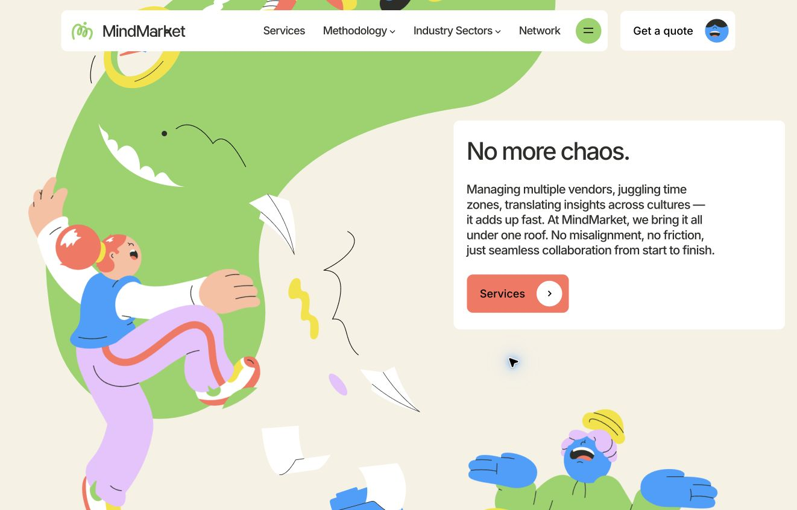

下面保留原始研究与最初提案的推导过程。第 7 节的三个方向板属于反馈前的研究提案，不作为最终视觉规格。第三方截图不进入公开官网。

## 1. 主要结论

思维印记 V2 最合适的方向，是**面向教育工作者的现代学习产品品牌**：用清楚的教学任务建立理解，用具有辨识度的图像与交互建立吸引力，用可查看的学生过程和教师界面建立可信度。学校采购者需要快速看懂它怎样进入教学，学生端又需要体现探索和创造的活力，两种诉求应在同一套设计中成立。

当前样本并不存在统一的“国际教育标准风格”。MagicSchool 的高饱和人物拼贴、SchoolAI 的大字与颗粒图像、Toddle 的浅色界面组合、Kognity 的深色衬线标题，都具有清楚的教育产品识别。这些网站真正共享的是：**明确的受众、可辨认的学习内容、具体的产品展示、稳定的排版体系，以及清楚的下一步入口**。[1–10]

建议以 **SchoolAI 的现代视觉表达 + Toddle 的产品信息组织 + Writing Coach 的学生／教师双视角**作为主要参考。Brilliant 适合补充“让访客看见一次学习如何发生”的动效思路。MagicSchool 值得借鉴功能的可发现性，但无需照搬其密集的星芒、发光图标和促销氛围。[1–4,8,11]

以下“视觉观察”来自当前网页画面；“判断”和“建议”属于设计分析，不代表已测得的学校偏好或转化效果。官网上展示的使用量、效果数字和认证只被视为品牌展示方式，本报告没有独立核验其商业、合规或教学效果主张。

## 2. 样本、范围与证据

本轮访问日期为 2026-09-11。主要面向中学、国际课程、学校及教师的产品，同时保留个人学习产品作为视觉对照。10 个品牌均已读取当前页面并查看浏览器画面；额外查看了三个专题内页。样本不是市场排名，也不代表所有国际学校常用产品。

| 品牌 | 样本类别 | 本轮实际检查 | 最值得观察的设计问题 |
|---|---|---|---|
| MagicSchool | 学校／教师 AI | 首页、工具展示区；写作反馈页文字 | 颜色、人物拼贴、工具卡如何共同形成产品感 |
| SchoolAI | 学校 AI 学习平台 | 首页、受众切换、内容区、Mission Control 内页 | 大字体、学科图像、学生与教师视角如何统一 |
| Khan Academy | 综合学习平台 | 首页、受众入口、页面内容 | 可亲近的学习品牌如何同时服务学校和家庭 |
| Khanmigo | 教学助手／学习辅导 | 首页、Writing Coach 内页 | AI 功能怎样以教学任务与过程呈现 |
| Toddle | 国际学校教学平台 | 首页、页面中段、IB DP 内页 | 宽广功能怎样分层展示而不失品牌一致性 |
| ManageBac+ | 国际课程／学校平台 | 首页、课程与功能导航 | 课程体系、功能模块、学校入口如何分工 |
| Kognity | 国际课程数字学习资源 | 首页、课程与资源入口 | 学术气质如何与现代产品界面结合 |
| Brilliant | 个人互动学习 | 首页、功能与课程结构 | 交互演示如何成为品牌主视觉 |
| Newsela | 学区内容／教学／评估 | 首页、产品与研究入口 | 内容产品如何向学校解释完整服务体系 |
| Diffit | 教师备课与材料工具 | 首页、工作流程与场景 | 简洁视觉如何突出可带走的教学产出 |

截图主要为 **1280 × 720 的桌面视口**，保留页面原有比例。浏览器请求 390 × 844 后实际视口仍返回 1280 × 720，因此本轮不把这些画面当作移动端证据，也不声称完成了移动端审查。字体表是该视口下的 CSS 计算值；字体族列表不等于已经逐字验证实际使用的字形。

部分网页具有轮播、渐入、动态标题、地域或 Cookie 状态差异；截图记录的是一个时间点。Toddle 的咨询浮层、ManageBac 的 Cookie 横条在部分记录中仍然可见。这些是访问状态，不能当作品牌构图不可分割的部分。第三方截图仅用于设计研究，不进入思维印记对外营销素材。

## 3. 十个品牌的网页风格拆解

### 3.1 MagicSchool：鲜明、热情、工具丰富

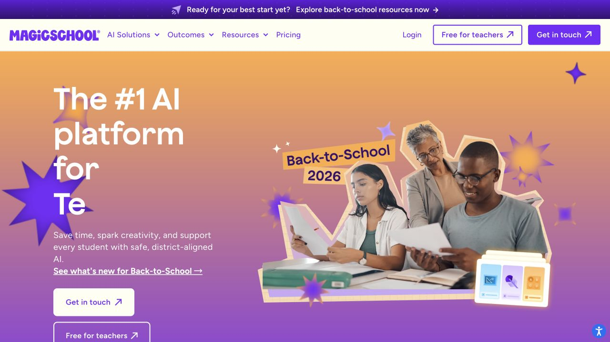

**视觉观察。** 紫色作为强识别色，当前开学季首屏叠加橙色到紫色的大面积渐变。师生人物以剪贴方式放在画面右侧，辅以带立体感的工具图标、星芒和纸片。左侧是大标题和直接行动入口，标题还有动态切换。导航采用浅底，和浓烈的首屏形成对比。标题计算值为 Jokker 字体族、64px、600 字重。[1]

**内容组织。** 首页先展示工具与用途，再区分学校、教师和学生，随后补充教师声音、信任与安全、专业学习和集成。工具展示中的名称与用途接近教师日常表达，访客不用先理解平台术语。写作反馈有独立详情入口。[1,14]

**设计判断。** 它的教育感来自人物关系、课堂情境和具体工具的共同出现。渐变和星芒单独使用时并不能带来这种识别。优点是热情、易识别；风险是信息和装饰密度较高，照搬容易让面向中学研究的产品显得偏低龄或宣传活动化。

**对思维印记的用法。** 借鉴工具目录的清楚命名和配图密度。每张思维工具卡都应说明何时使用、学生做什么、完成后留下什么。保留统一的品牌色，但控制星芒、阴影、发光和贴纸的数量。

### 3.2 SchoolAI：现代、开放、以学习内容建立 AI 感

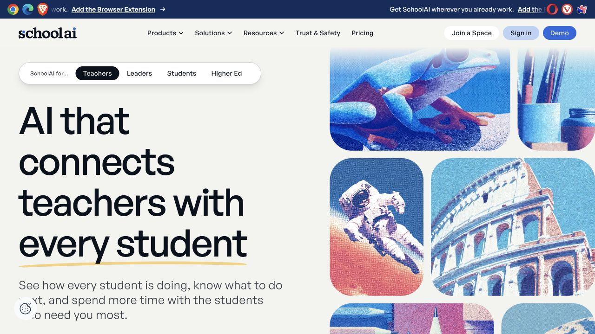

**视觉观察。** 米白背景、接近黑色的大标题、蓝色操作按钮，配上黄色的手绘下划线。右侧使用学科内容图像组成圆角网格：动物、建筑、太空、文具等都有统一的颗粒与色调处理。图像会变化，主体版式保持稳定。标题为 General Sans 字体族，当前桌面计算值 81px、500 字重、略紧字距。[2]

**内容组织。** 首屏有教师、学校管理者、学生、高等教育的受众切换。本轮实测从 Teachers 切换到 Leaders 后，标题、副文案与入口随之改变。Mission Control 内页沿用相同的字体、蓝色和图像网格，却把内容换成学生状态、学习进展与教师信息。[2,12]

**设计判断。** 同一套构图能容纳知识探索、学生支持与教师观察，品牌的扩展性很好。它不是每一页都堆一个完整电脑屏幕，而是把一个有意义的界面局部放大，让访客知道这一块在说明什么。

**对思维印记的用法。** 这是最值得研究的视觉主参考。可以用真实的阅读片段、论证结构、思维卡和过程报告形成统一画面。首页同时呈现学生端发生的动作与教师端收到的证据，帮助学校理解产品关系。对其学校效果数字应另行核验，不作为思维印记的可借用主张。

### 3.3 Khan Academy：开放、清楚、学习入口优先

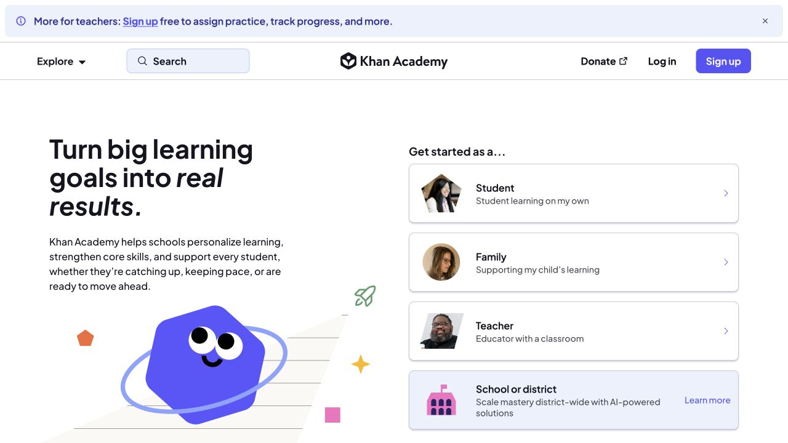

**视觉观察。** 当前首页使用白底、深色文字、紫蓝色按钮与浅色区域。左侧标题与简短说明，右侧直接列出学生、家庭、教师、学校／学区入口。人物小图、几何角色和学习符号共同出现，视觉活泼但版面相对规整。标题为 Plus Jakarta Sans 字体族、42px、700 字重，重点词用斜体处理。[3]

**内容组织。** 产品入口本身占据了重要首屏位置，后续有内容分类、学习机制和不同受众收益。当前页面已经直接介绍学校如何使用 AI 支持学习，不能只沿用过去“免费课程库”的印象来评价它。[3]

**设计判断。** 教育品牌的熟悉感来自访客能够迅速识别自己的身份和学习任务。主导航、主内容、入口按钮之间的优先级很明确。它的可亲近程度较高，但几何角色的拟人表情并非所有中学或机构品牌都需要。

**对思维印记的用法。** 首页提供“学校与机构”“教师”“体验学习空间”的清楚路径。Lite、Pro 应在用途被理解之后出现；直接把两个版本名当作唯一入口，会迫使第一次访问的人先研究产品命名。

### 3.4 Khanmigo 与 Writing Coach：教学过程就是产品说明

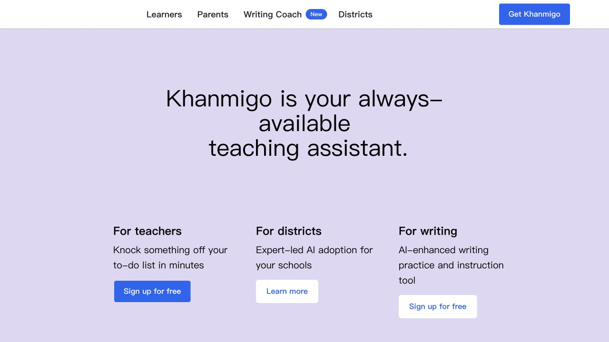

**视觉观察。** Khanmigo 首页用浅薰衣草背景、居中标题与三个用途入口，较少依靠复杂装饰。Writing Coach 则采用暖米白底、蓝色按钮，并在首屏下部呈现写作界面。该家族以较常规的无衬线字体和柔和背景保持可读性；首页标题计算值为 Lato 字体族、48px、400 字重。[4,11]

**内容组织。** Writing Coach 的页面同时交代学生写作引导、修改反馈与教师可见的过程信息。这和思维印记的写作面存在直接的叙事关联。页面展示了从写作开始到修改的支持，教师入口反复出现。[11]

**设计判断。** 功能页有一个明确的教学对象，截图与文案可以相互解释。它不需要让访客阅读模型架构，便能说明 AI 在什么环节提供帮助。首页本身的视觉张力相对有限，不适合作为思维印记想要“大胆设计”的唯一参考。

**对思维印记的用法。** 写作页以“学生自己的草稿—AI 的问题与批注—学生的修改—教师看到的过程”组织图片。AI 不代写正文的边界应通过示例体现，同时清楚区分项目制作中可以由 AI 执行的工作。

### 3.5 Toddle：产品系统完整，视觉温和而成熟

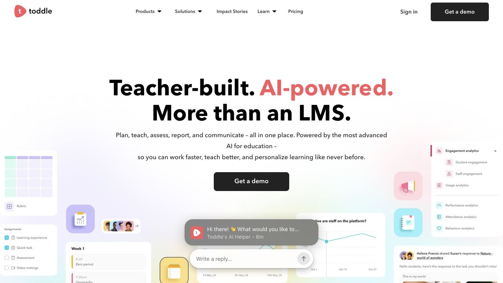

**视觉观察。** 首页大量使用白色留白、粗黑标题、珊瑚色强调和浅彩色的产品界面局部。产品片段从画面边缘进入，把居中标题围在其中。主按钮为黑色，视觉重心明确。标题字体族为 Avenir Next World Bold，计算字号 56px；CSS 的 weight 为 400，但字体文件本身是 bold，不能简单归类为细字。[5]

**内容组织。** 首页按课程规划、评估、学生档案、报告等教学工作展示平台；IB DP 内页进一步使用教师熟悉的课程术语，并加入界面图。该内页采用高饱和蓝紫底与白色内容，说明同一个品牌可以在专题页加大色彩强度。[5,13]

**设计判断。** 它的专业感由完整的信息体系、界面细节和教师视角共同支撑，柔和配色并没有削弱专业性。比较值得借鉴的是“首页总览—模块详情—课程场景”的层次，而非每个页面都完整重复全部功能。

**对思维印记的用法。** 课程、阅读、写作、项目、兴趣探索、评估都需要可到达的详情，但首页只需让访客看懂关系和代表性价值。技术原理适合放在评估依据或资源中，主导航优先服务教学问题。

### 3.6 ManageBac+：学校系统品牌，课程分类明确

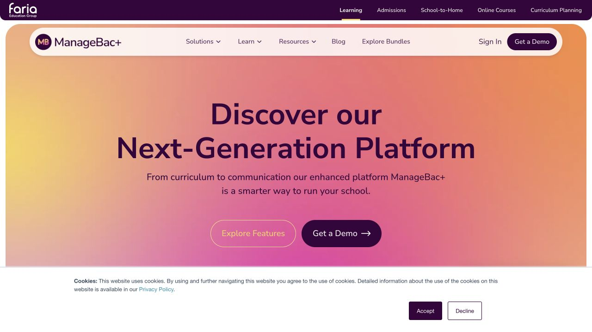

**视觉观察。** 当前版本以深紫品牌色配橙、粉、黄的暖色渐变，主导航位于圆角浅色容器内；大标题居中，按钮成组出现。页面顶部还保留集团产品导航，呈现的是较完整的学校软件体系。标题为 Nunito Sans、64px、700 字重。[6]

**内容组织。** 解决方案按 IB 和其他课程体系分类，功能模块另行展开，支持、学校案例与服务信息也有独立入口。它能让课程协调员通过熟悉的术语找到内容。[6]

**设计判断。** “专业的国际学校网站”也可以使用明亮渐变，深色与低饱和并非必要条件。不过集团导航、产品组合与全校管理叙事会强化大型供应商的感觉，这正是思维印记需要有选择地借鉴的部分。

**对思维印记的用法。** 借鉴基于课程情境的导航，避免复制“全校统一系统”的承诺。思维印记目前应清楚讲述阅读、写作、研究与过程评估，不能因参考 ManageBac 就增加作业提交、排课、学籍管理等不存在的功能。

### 3.7 Kognity：学术气质与现代软件的结合

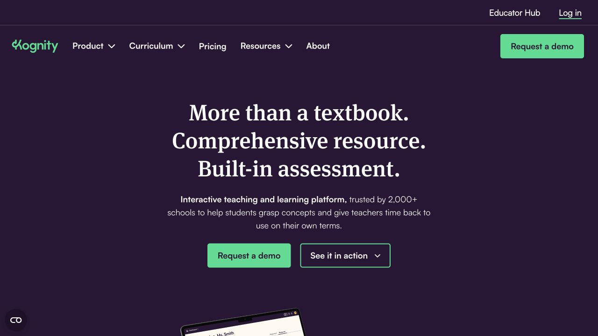

**视觉观察。** 深茄紫色背景、白色衬线标题和薄荷绿按钮形成强烈对比。标题采用 FF Meta Serif 字体族、48px、700 字重、60px 行高。下方的设备与产品界面带来数字学习的具体感；课程、资源和演示入口保持直接。[7]

**内容组织。** 课程体系和教师支持都很突出，课程资源、学习情况与学校使用之间的关系清楚。学校标志、教育工作者声音与资源内容构成了专业背景。[7]

**设计判断。** 它说明深色页面也可以明显属于教育领域。关键是字体、正文内容与产品画面的搭配。深色满屏若仅剩抽象背景与宣言，则容易偏向科技公司或品牌形象站。

**对思维印记的用法。** 可借鉴它对学术感的处理，尤其适合研究、写作和评估内页。若首页采用这一方向，需要用明亮的卡片和可读的界面截图保持亲近性，避免给人“研究院介绍页”的距离感。

### 3.8 Brilliant：让一次学习成为主视觉

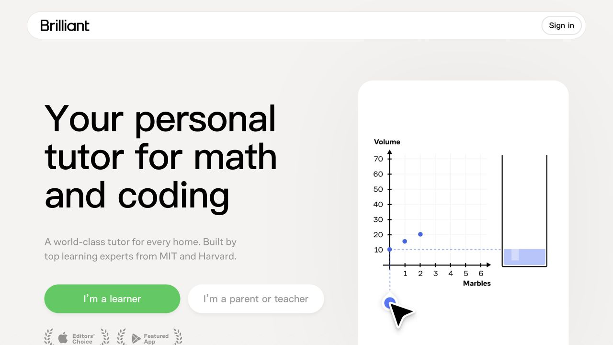

**视觉观察。** 暖灰白底、非常大的黑色无衬线标题、绿色按钮，右侧是一张干净的互动演示面板。当前首屏演示把弹珠数量与图表联系起来，后续也通过几何、代数等内容展示学习体验。标题为 CoFo Robert 字体族、76px、500 字重，紧字距和紧行距强化了清楚、直接的感觉。[8]

**内容组织。** 它优先解释学习方式，再展示学科和课程范围，学习者与家长／教师入口分开。网页上的演示具有明确教学对象，动画承载了信息。[8]

**设计判断。** 这是“有趣且专业”的重要参考：可操作或可观看的学习步骤，比抽象的教育图标更能说明产品。其导航和销售路径较适合个人学习服务，不能直接套成学校采购网站。

**对思维印记的用法。** 可以展示一个短案例：把未经核查的主张放入信源检查，区分证据与结论，加入反例，然后在过程记录中看到修改。官网演示需标明是示例；不能伪装成现场调用模型或生成真实学生评估。

### 3.9 Newsela：模块清楚、教学数据与产品组合并重

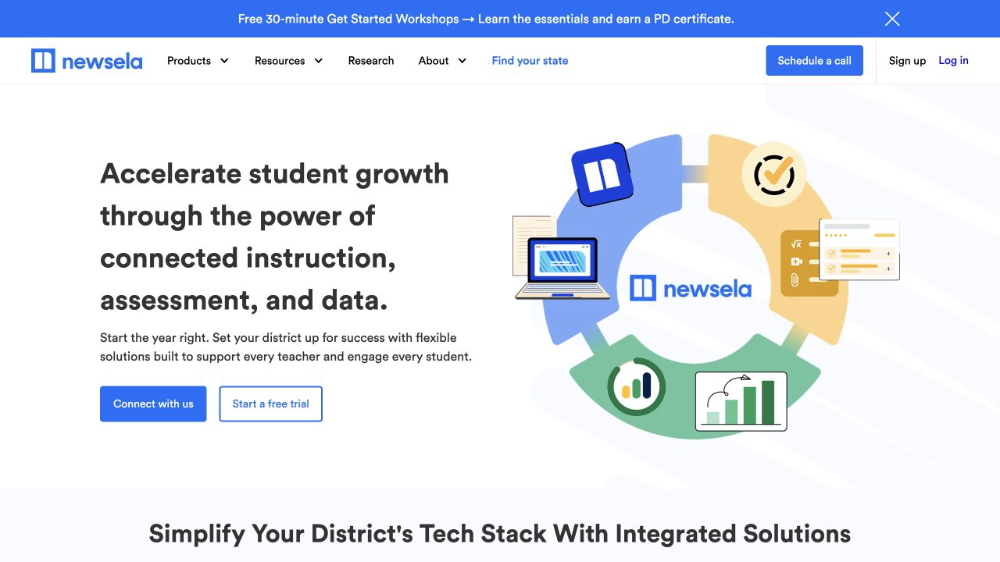

**视觉观察。** 白底与明亮蓝色是主基调，配黄、绿等功能色。左侧标题和说明，右侧用环形结构组合内容、评估与数据图标，构成易于辨认的系统图。标题为 Circular Std 字体族、36px、700 字重，行高较宽，阅读节奏偏稳。[9]

**内容组织。** 产品、研究和学校联系在导航中都有清楚位置，正文把内容、评估和数据放在同一个学校场景中说明。它使用研究入口支持效果主张，而非只有一个孤立的数字。[9]

**设计判断。** 视觉较规整，适合多产品组合；吸引力更多来自内容清楚而非特别大胆的艺术设计。环形系统图能够迅速表达关系，但若所有页面都使用类似图形，也容易产生通用企业软件感。

**对思维印记的用法。** 学生学习—过程记录—教师观察可以用一张清楚的关系图说明。评估依据应有可进一步阅读的入口；没有完成外部验证的内容，只能说清方法和证据范围，不能套用其他品牌的效果叙事。

### 3.10 Diffit：低门槛、清楚的教师任务与产出

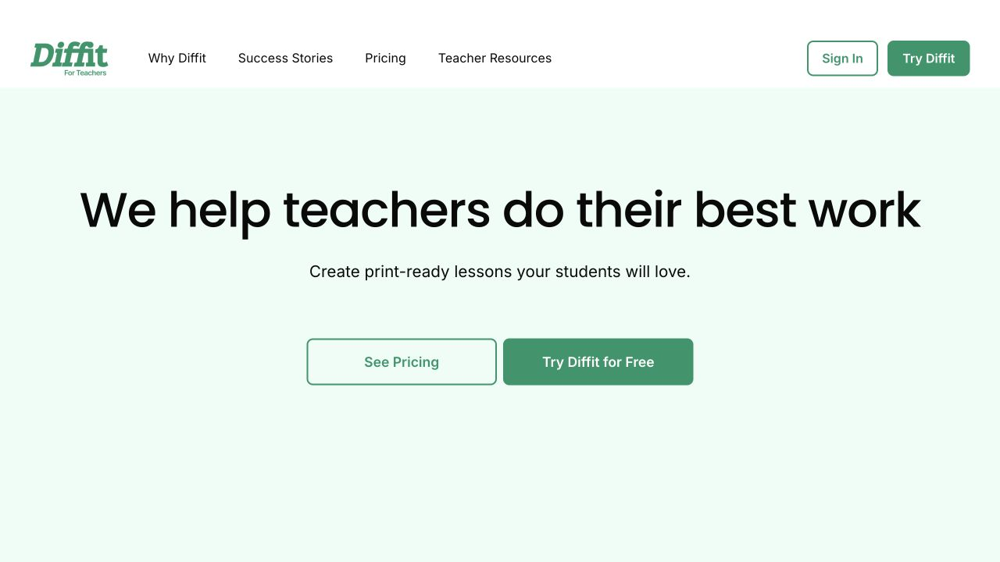

**视觉观察。** 白色与浅薄荷绿的大块区域、宽大的居中标题、绿色实心和描边按钮，页面装饰较少。品牌字标带有自己的字体性格，正文保持清楚。首页标题计算值为 Poppins、约 62px、500 字重。[10]

**内容组织。** 首页的工作流从教师已有材料出发，接着形成资源，再打印、导出或分享。教学场景以教师能识别的任务分类，不要求访客先懂 AI 技术。调查数据附近交代样本来源，这是证据展示形式上的可取之处。[10]

**设计判断。** 清楚的对象和可带走的产出，使页面即使没有复杂首屏插画也具备教育工具感。它的表现比较朴素，可以用作信息清楚度的参考，不宜直接作为思维印记的全部视觉方向。

**对思维印记的用法。** 每项功能都展示具体产出，例如阅读笔记、论证结构、自己修改的草稿或过程报告。让教师知道学生完成一次使用后，可以带回课堂讨论什么。

## 4. 网页风格的共性：可以具体落到设计上的七件事

### 4.1 字体负责建立第一层品牌性格

当前样本多数使用具有一定圆润度或人文感的无衬线字体，字重不一味追求最粗；Kognity 通过衬线标题建立更强的学术气质。标题明显大于正文，但不同网站因句长、布局和目标不同，数值差别很大。[1–10]

| 品牌 | 首页标题字体族 | 字号／行高 | 字重 | 视觉作用 |
|---|---|---|---|---|
| MagicSchool | Jokker | 64／73.6 px | 600 | 热情、清楚，适合活动式首屏 |
| SchoolAI | General Sans | 81／88 px | 500 | 大尺度、有呼吸感，字距较紧 |
| Khan Academy | Plus Jakarta Sans | 42／46.2 px | 700 | 紧凑清楚，为角色入口留空间 |
| Khanmigo | Lato | 48／52 px | 400 | 平和、易读，装饰性较弱 |
| Toddle | Avenir Next World Bold | 56／64 px | 字体文件为 Bold | 温和而有力度 |
| ManageBac+ | Nunito Sans | 64／73.6 px | 700 | 圆润、成熟，兼容学校系统定位 |
| Kognity | FF Meta Serif | 48／60 px | 700 | 学术与出版感 |
| Brilliant | CoFo Robert | 76／79.8 px | 500 | 直接、现代，演示占据另一侧 |
| Newsela | Circular Std | 36／54 px | 700 | 稳定、信息导向 |
| Diffit | Poppins | 62.08／76.48 px | 500 | 友好、宽松、容易进入 |

这是一组当前桌面计算值，不是推荐照抄的规范。中文页面应重新安排字数和断行，不能把英文 80px 大标题机械搬过来。思维印记的中英文应共享层级、对齐和疏密关系，允许字体与断行各自调整。字体选择还需核验授权与实际加载效果。

### 4.2 色彩有主次，教育感也需要内容支持

白、米白或浅彩底可以承载长篇信息，品牌色负责导航、按钮、少量强调与重点区域。深色可以用于研究与评估，明亮色可以用于课程与探索；两者都应有清楚的文本对比。样本并未支持“教育网站必须用蓝绿”或“专业网站不能用紫色”的结论。

思维印记可以采用一个稳定主色、少量功能辅助色与大面积中性底。课程分类色、兴趣树颜色和官网按钮色应分清用途，避免所有颜色同时争夺注意力。配色的最终检验包括文字可读性、色觉差异和中英文页面的整体平衡，而不仅是色板是否好看。

### 4.3 主视觉有明确教学对象

样本中最有说明力的画面可分为三类：师生共同工作、真实学习内容、可辨认的产品交互。抽象图形承担衬托、组织和形成识别的作用。SchoolAI 的学科图像、Brilliant 的题目演示、Toddle 的界面片段，分别走了不同的路线，却都能让访客理解网站与学习的关系。[2,5,8]

思维印记首屏宜出现可识别的对象：一个研究问题、一段材料、学生的判断、一张思维卡、一处修改、一份给教师看的记录。生成图可制作统一风格的学科插画和视觉背景；实际产品界面的文字、状态和按钮应由真实截图或可编辑的页面元素承担。

### 4.4 产品截图需要编辑与讲解

整屏软件截图缩到几百像素后通常读不清。有效的展示会选择一处核心操作，保留足够上下文，把重要文字做成可读的局部，配一句说明。一个模块回答一个问题，避免在同一画面里同时解释阅读、写作、评估和后台管理。

思维印记适合一套固定的展示形式：左侧为教师关心的问题，右侧为经过裁切的真实界面，下面列出学生动作与可见产出。允许制作示意界面，但应标明“交互示例”，避免把概念设计混入已上线功能证明。

### 4.5 留白与页面节奏决定内容是否显得专业

留白不是简单减少内容。首屏负责定位和入口，接下来的模块负责证明和展开；大画面、图文对照、功能目录、案例和常见问题交替出现，能在信息完整的同时维持阅读节奏。Toddle 与 SchoolAI 的不同模块都维持了稳定的字体、按钮和图像风格。[2,5]

思维印记不宜让整站由同一种三列圆角卡片构成，也不宜连续数屏都只有居中标题和抽象图。可以将“图像叙事—功能浏览—一次真实过程—教师界面—版本选择”排成不同的节奏。

### 4.6 AI 感适合来自可见的响应与关联

动态标题、图像轮播和渐变能够制造新鲜感，但与产品能力的联系较弱。更有辨识度的做法是让访客看到材料被组织、问题被提出、证据被连接、反馈被使用。Brilliant 用学习对象的变化展示体验；SchoolAI 把学生互动与教师信息放进统一的表现体系。[2,8,12]

建议官网只设计少数有意义的动效：选择一个来源后出现对应检查问题；从论点切换到证据后显示连接；完成一个示例步骤后过程记录增加一项。每个动效都应可跳过、可停留阅读，并尊重减少动态效果的系统设置。没有实际运行 AI 的地方，不显示虚假的“正在思考”状态。

### 4.7 专业可信度在整站中分层出现

学校标志、实名教师、示例材料、研究与隐私入口、产品使用支持，在学校型网站中反复出现。这些不是可以随意添加的装饰，而是不同类型的证据。[1,2,5–7,9]

思维印记初期最可靠的素材是实际产品界面、可复现的学习案例、工具卡内容、示例报告和明确的产品边界。有真实授权时再加入学校与教师案例。机构采购页应能回答接入方式、账号组织、可见范围和支持安排；尚未确定的服务条款不应被包装成已经提供的承诺。

## 5. 现有思维印记官网的具体差距

当前首屏以深蓝绿色流体为大背景，配大号中文标题、小型探索船与“开始探索”。画面有独立的视觉吸引力，但第一屏的具体信息较少：访问者尚不能看见学生做什么、教师看到什么，学校如何开始也没有成为画面焦点。这是它容易被理解为品牌形象站的原因之一。[15]

本地代码和当前网站都已经包含课程、写作、过程评估、教师端与真实案例，不能把问题简单概括成“没有功能介绍”。更准确的问题是：**信息出现的先后、入口的可发现性、截图的可读性，以及 Lite 新能力的覆盖程度**。主导航为首页、解决方案、技术、关于我们；首页先讲能力理念，再进入产品。学校教师需要自行把理念转换成自己的教学场景。

Lite 的探索、兴趣树、独立阅读、写作和 PBL 项目在当前代码与文档中有明确位置；现官网的重心则偏向较早的课程与写作工作室结构。V2 应重新梳理能力目录，并在上线前逐项确认版本可用范围。这里的核对是仓库层面的能力梳理，不等于已经验证每个线上功能的完整运行状态。

旧版值得保留的素材包括真实案例录屏、课程封面、思维卡、教师周报、学生详情和示例评估报告。复用它们的内容，可以重新设计展示外框、裁切、说明和版面顺序。V2 保持独立部署；当前站点代码未在本轮修改。

## 6. 三条可比较的视觉方向

以下是供选择和验证的设计提案，色值、版式与比例均为建议，不是从参考品牌复制的规范。配套视觉参考板提供了同一段内容在三种方向下的简化排版实验。

### A. 明亮的探究学习空间——推荐作为主方向

**视觉性格：** 专业、现代、开放、有探索欲。米白底搭配钴蓝、少量柠檬黄与薄荷绿；大字号无衬线标题，足够留白，图像带统一颗粒或纸张质感。参考 SchoolAI 的表现手法和 Toddle 的功能组织。

**首屏画面：** 主标题解释学校得到的价值；另一侧是学生的研究问题、证据卡与教师观察之间的关联。学科插画可占据背景或边角，但画面中心必须包含能读懂的产品内容。首屏两个入口分别服务学校了解和产品体验。

**适合原因：** 可以同时容纳 Lite 的兴趣探索与 Pro 的系统研究。它有足够的活力，也容易向教师报告、资源和机构页面扩展。主要风险是圆角卡片、图像、彩色标签过多，变成常见的软件模板；需要通过独有的学习过程图和内容编辑避免。

**建议色板：** #263DA8、#F7F7F2、#EFD56A、#CBE4D5、#151B2C。色板仅表达方向，最终需做对比度与页面验证。

### B. 现代学术编辑风格

**视觉性格：** 沉稳、精确、具有国际课程与出版物气质。暖白与深墨色为主，衬线英文标题搭配清楚的中文字体，少量青绿强调。参考 Kognity 的学术感，减少整屏深色比例。

**首屏画面：** 一个具体的学生研究问题与证据结构占据中心位置，搭配批注、来源与过程说明。使用精细的线条、文献式排版和高质量的局部截图。报告与研究依据页面能够自然延续。

**适合原因：** 与 IB 写作、研究、判断和过程评估关系紧密，适合在学校课程团队面前解释方法。主要风险是显得像智库或教育咨询公司，因此必须将可操作的产品入口、课程和学习示例前置。

**建议色板：** #172D2A、#F5F1E8、#72B49B、#D9A76E、#FFFFFF。英文衬线只用于少量标题，不能让正文变成论文样式。

### C. 活跃的 AI 学习工作坊

**视觉性格：** 大胆、可参与、有活动感。更强的彩色区块、统一风格的纸片／印刷图像、大型工具卡与简短动效。借鉴 MagicSchool 的热情和 Brilliant 的互动演示，控制儿童化角色。

**首屏画面：** 访客进入一个简短学习示例，例如选择一个来源、检查一条论据或调整一次研究问题。画面会随选择发生有意义的变化，同时明确标注这是演示。教师视角可以切换查看对应过程记录。

**适合原因：** 最能展示“趣味与交互”，适合公开演示、工作坊和品牌传播。主要风险是像个人学习 App 或培训活动页，机构采购与信任内容需要更稳重的独立模块支撑。

**建议色板：** #4634AB、#F2CE52、#F3EFE8、#C9DEED、#212126。避免整页同时叠加高饱和渐变、发光、浮动、旋转和打字机效果。

**建议取舍。** 首页采用 A；写作、评估和研究内容吸收 B 的精确；课程与工具演示吸收 C 的互动。三者共享同一字体层级、按钮、网格与图像处理规范，不在每个页面更换品牌。

## 7. 由研究导出的 V2 信息结构

首先说明教育用途，然后解释产品能力，再支持学校判断是否适合。Lite 和 Pro 是两种产品组织方式，不宜在缺少说明时被理解成免费／付费、高低能力或学生／学校的二分。

| 一级入口 | 页面目的 | 应覆盖的内容 |
|---|---|---|
| 产品 | 快速理解可以做什么 | 探索与兴趣树、阅读、写作、项目、互动课程、思维工具卡、过程评估 |
| 学校与教师 | 解释教学与机构使用 | 学生过程、教师查看与反馈、班级组织、实施范围、演示入口 |
| 教学场景 | 将能力放入真实任务 | 阅读讨论、研究与论证写作、跨学科探究、PBL；IB 场景须准确限定 |
| 资源 | 支持进一步理解和课堂使用 | 示例报告、思维工具说明、课程样例、教学方法与产品使用资料 |
| 版本 | 帮助判断 Lite 与 Pro 的适用情境 | 功能范围、代表性流程、真实入口；价格和权益待实际商业方案确定 |

技术细节与团队介绍可放在次级导航和页脚；如果已有足够成熟的评估依据，可在资源下提供独立详情。不得把“适合 IB 任务”写成“IB 官方认可”，也不使用未经授权的学校标志。

首页建议顺序：

1. **学校价值与产品主视觉。** 一句话说明服务对象和学习用途，画面包含学生与教师两端，提供学校了解与体验入口。
2. **能力总览。** 六至七个清楚命名的功能，代表图像和一句具体用途；可进入详情。
3. **一次学生学习过程。** 沿一个真实案例展示阅读、判断、论证与反思，不必一次展示整个产品。
4. **教师视角。** 对应上一案例，呈现可追溯的记录、示例报告和教师可采取的教学行动。
5. **课程与思维工具。** 展示真实封面与卡片内容，并解释怎样用于课堂或自主学习。
6. **教学场景与版本。** 让机构理解 Lite 与 Pro 的不同组织方式，以及哪些课程或项目适用。
7. **方法、边界与接入。** 说明 AI 的分工、过程评估依据、账号与使用支持；对外承诺必须有证据。
8. **学校行动入口。** 如果演示预约流程尚未确定，先提供真实可用的联系渠道或体验方式，不做提交后无人处理的表单。

## 8. 视觉素材与制作要求

**可复用。** 旧站的课程封面、思维卡、案例录屏、教师界面和报告。引用现有官网的公共 OSS/CDN 资源，保留与学生平台素材存储的边界。使用版本化文件名更新素材，避免覆盖旧站使用的对象。

**适合新制作。** 统一风格的学科插画、一套学习过程连接图、学生与教师双视角的产品展示框架，以及少量解释动作的动效。生成图适合承担插画、质感和场景，不负责制造带有假文字的产品屏幕；SVG／HTML 更适合清楚可编辑的关系图与交互示例。

**暂不作为定稿。** 研究前生成了一张钴蓝雕塑与书本的首屏候选图，存放在 assets/hero-concept-unselected.png。它有视觉质感，但教学对象和产品特征偏弱，不能仅因“精致”就确定为首页核心图。若使用，应配合真实学习内容，并重新检验是否仍然像通用科技品牌。

**实施验收重点。** 桌面与手机都能迅速看懂受众、功能与入口；功能卡、语言切换、导航和表单具有真实行为；示例与已上线功能明确区分；截图文字可读；视频有静态海报；内容不依赖动画才出现；减少动态效果设置生效；素材未加载时布局稳定；中英文各自有合理断行。以上属于 V2 的待验证设计要求，本轮没有宣称完成实现。

## 9. 当前决策状态

研究支持先确定“明亮、专业、可见学习过程”的方向，再做具体首页和内页。当前仍需要在真实页面中验证中文标题密度、首屏学习案例的可读性、兴趣探索与教师价值的比例，以及 Lite／Pro 的说明方式。学校接入、价格、认证与使用成效均须按已确定事实编写，不能由设计自行补齐。

本轮交付为设计研究、截图证据与三个方向的排版实验。旧官网保留，V2 页面尚未开始实现。视觉参考板中的自制排版是设计提案，不是已经完成的官网。

## 来源与本地依据

下列网页均在 2026-09-11 访问。首页没有稳定发布日期，因此记录访问日期；页面数字、认证及效果主张未在本报告中独立审计。截图与字号证据保存在同目录 assets 中。编号对应正文引用。

1. MagicSchool. [AI Platform for School Districts](https://www.magicschool.ai/). 当前首页与工具展示画面。
2. SchoolAI. [AI Built for Education](https://schoolai.com/). 当前首页、受众切换及内容区。
3. Khan Academy. [Khan Academy](https://www.khanacademy.org/). 当前首页与角色入口；页面正文通过浏览器读取。
4. Khanmigo. [Teaching assistant & tutor](https://www.khanmigo.ai/). 当前首页。
5. Toddle. [Learning Management System for K12 Schools](https://www.toddleapp.com/). 当前首页、模块及资源入口。
6. ManageBac+. [Whole School Learning Platform](https://www.managebac.com/). 当前首页、课程分类与功能导航。
7. Kognity. [Digital Curriculum and Online Learning Platform](https://kognity.com/). 当前首页、课程与资源入口。
8. Brilliant. [Your Personal Tutor for Math and Coding](https://brilliant.org/). 当前首页与学习演示。
9. Newsela. [Newsela](https://newsela.com/). 当前首页、产品及研究入口。
10. Diffit. [Diffit](https://web.diffit.me/). 当前营销站首页与三步工作流；diffit.me 会进入应用，不应混为营销站样本。
11. Khanmigo. [Khan Academy Writing Coach](https://www.khanmigo.ai/writingcoach). 写作过程与教师视角内页。
12. SchoolAI. [Mission Control](https://schoolai.com/products/mission-control). 教师／学校信息与产品画面内页。
13. Toddle. [IB DP](https://www.toddleapp.com/ib-dp/). 国际课程专题页。
14. MagicSchool. [Writing Feedback Tool](https://www.magicschool.ai/tools/writing-feedback). 功能详情文字资料；未纳入视觉主样本。
15. 思维印记. [当前官网](https://mind.uni-robot.cn/). 当前线上首屏及信息组织；上线版本可能与仓库不同步。

本地产品依据：仓库根目录 AGENTS.md（当前产品边界与平台约束）；CLAUDE.md（导入 AGENTS.md）；README.md（历史概览，旧规则以 AGENTS.md 为准）；apps/lite-web/README.md（五个学习入口与项目工具）；apps/site/src/components/Nav.astro、产品页面与 assets/README.md（现站导航、素材与展示内容）；docs/2026-09-01-eco-lite-original-intent-verbatim.md（兴趣树与 PBL 原始意图）。本轮未依据历史 README 将已废弃规则写回设计。
